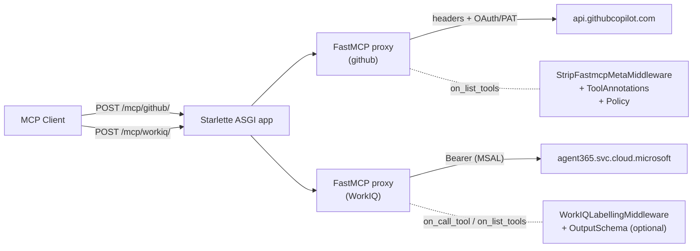

# Fides Gateway

A multi-server MCP proxy that sits between an MCP client and one or more remote MCP servers. Built on [FastMCP](https://github.com/PrefectHQ/fastmcp) (`fastmcp>=3.2.0`): under the hood the gateway builds one `fastmcp.server.create_proxy(...)` per upstream and mounts each under `/mcp/<server_id>/` on a single Starlette ASGI application. Per-server middleware can advertise per-tool annotations and OPA Rego policies in `tools/list` responses, label tool results, etc.

The gateway also registers a policy-evaluation tool on every proxy:

- `eval_policy` — evaluates a Rego policy against a proposed tool call. Arguments are flat values and IFC labels travel separately in `_meta["com.github.ifc/labels"]`, keyed by [RFC 9535 JSONPath](https://www.rfc-editor.org/rfc/rfc9535) singular-query strings into the call (e.g. `"$['name']"`, `"$['arguments']['foo']"`, `"$['arguments']['items'][0]"`, or the call-level fallback `"$"`). The policy resolves any node's effective label via the `ifc.label("<jsonpath>")` Rego extension.

Backed by [regorus](https://github.com/microsoft/regorus); every upstream tool is also exposed to the policy as `upstream.<ToolName>(args)`.

## Usage

```
python gateway.py [--config config.json] [--token_cache PATH] [--host HOST] [--port PORT]
```

Defaults: `--config config.json`, `--host 127.0.0.1`, `--port 9090`, `--token_cache ~/.cache/fides-gateway/msal_cache.json`. The gateway prints the mounted proxy endpoints on startup.

Connect clients per upstream:

```
http://<host>:<port>/mcp/<server_id>/
```

For example, with the [`config.github.example.json`](config.github.example.json) sample which defines a `github` server, clients hit `http://127.0.0.1:9090/mcp/github/`.

### Configuration file

The configuration file is a JSON object with a single required top-level key, `mcpServers`, mapping server IDs to per-server configurations:

```json
{
  "mcpServers": {
    "github": {
      "type": "http",
      "url": "https://api.githubcopilot.com/mcp/",
      "headers": { "Authorization": "Bearer ghp_..." },
      "middleware": [
        { "type": "ToolAnnotationsMiddleware",
          "toolAnnotations": {
            "*": { "destructiveHint": true, "openWorldHint": true },
            "list_issues": { "readOnlyHint": true, "destructiveHint": false }
          }
        },
        { "type": "PolicyMiddleware",
          "policies": {
            "*":          { "literal": "package policy\n\ndefault allow := true\n" },
            "delete_file":{ "literal": "package policy\n\ndefault allow := false\n" }
          }
        }
      ]
    }
  }
}
```

#### Per-server fields

| Key          | Required | Description                                                                            |
| ------------ | -------- | -------------------------------------------------------------------------------------- |
| `type`       | yes      | Must be `"http"`. (Other transports not yet supported.)                                |
| `url`        | yes      | Streamable HTTP URL of the upstream MCP server.                                        |
| `headers`    | no       | Object of string→string headers added to every upstream request. GH PAT auth lives here.  |
| `msal`       | no       | MSAL / Entra ID interactive auth. Mutually exclusive with `oauth`. See below.          |
| `oauth`      | no       | OAuth 2.0 client provider. Supports both Dynamic Client Registration and pre-registered client credentials. Mutually exclusive with `msal`. See below. |
| `middleware` | no       | Array of middleware entries applied to this proxy in order. See [Middleware](#middleware). |

#### `msal` (Entra ID / WorkIQ)

```json
"msal": {
  "tenantId": "...",
  "clientId": "...",
  "scopes": ["https://agent365.svc.cloud.microsoft/.default"],
  "callbackPort": 8080
}
```

| MSAL key       | Default | Description                                                                                |
| -------------- | ------- | ------------------------------------------------------------------------------------------ |
| `tenantId`     | _(req)_ | Azure AD tenant ID.                                                                        |
| `clientId`     | _(req)_ | Azure AD application client ID.                                                            |
| `scopes`       | `None`  | Scopes / resource for token acquisition.                                                   |
| `callbackPort` | `8080`  | Localhost port for the interactive-login redirect.                                         |

On first run the gateway opens a browser for interactive login; the MSAL token cache (including refresh tokens) is persisted to `--token_cache` so subsequent runs silently refresh.

#### `oauth` (GitHub etc.)

All fields are optional. If `clientId` is omitted the gateway performs Dynamic Client Registration with the upstream. If `clientId` (and optionally `clientSecret`) is provided, those static credentials are used instead — required for providers like GitHub that don't expose a DCR endpoint.

```json
"oauth": {
  "clientId": "your-github-oauth-app-client-id",
  "clientSecret": "your-github-oauth-app-client-secret",
  "scopes": ["repo", "read:user"],
  "callbackPort": 8765
}
```

| OAuth key      | Default | Description                                                                            |
| -------------- | ------- | -------------------------------------------------------------------------------------- |
| `clientId`     | `None`  | Pre-registered OAuth client ID. Omit to use DCR.                                       |
| `clientSecret` | `None`  | Pre-registered OAuth client secret.                                                    |
| `scopes`       | `None`  | OAuth scopes to request.                                                               |
| `callbackPort` | `None`  | Fixed port for the OAuth callback (defaults to a random free port).                    |

### Middleware

The `middleware` array on each server is processed in order. The config-driven dispatch in `MCPGateway._build_proxy` recognizes the following types:

#### `MetaPrefixTranslationMiddleware`

Bidirectionally rewrites the prefix of `_meta` keys between a client-facing namespace and the gateway's canonical namespace. Configured with a `prefixMap` of `{client_prefix: proxy_prefix}` pairs:

- On *incoming* `tools/call` requests, any `_meta` key starting with a configured `client_prefix` has that prefix replaced with the corresponding `proxy_prefix` before the rest of the chain sees it.
- On *outgoing* `tools/list` responses and `tools/call` results, any `_meta` key starting with a `proxy_prefix` is rewritten back to the `client_prefix`.

The main use is interoperating with clients that speak a shorter namespace than the gateway's canonical `com.github.ifc/…` one (e.g. mapping `ifc/` ↔ `com.github.ifc/` so that `ifc/labels` on the wire maps to `com.github.ifc/labels` internally and back).

```json
{ "type": "MetaPrefixTranslationMiddleware",
  "prefixMap": {
    "ifc/": "com.github.ifc/"
  }
}
```

Matching is by string `startswith` (configure each prefix with whatever boundary delimiter you want — typically `/`). When multiple `client_prefix` strings would match the same key, the longest match wins; the rewritten key is never re-translated. Each `proxy_prefix` value must be unique across the map so the reverse direction is unambiguous.

**Ordering constraint:** because FastMCP runs the response chain in reverse-registration order, this middleware must be listed **first** in the server's `middleware` array — that makes it the outermost wrapper of the chain, so it translates client-prefixed keys *before* downstream middleware (e.g. `PolicyMiddleware`) inspects them on the way in, and runs *last* on the way out so every other middleware has already finished writing canonical-prefixed keys by the time it rewrites them back to the client namespace. Listing it anywhere else lets canonical-prefixed keys leak through to the client.

#### `LabelConversionMiddleware`

Translates IFC label principals between the GitHub handles exposed to clients and the Microsoft user IDs used internally by labelers and policies. Labels travel in `_meta[IFC_LABELS_META_PREFIX]` as a mapping from JSONPath strings to [`IFCLabels`](lattice.py)-shaped dicts; this middleware rewrites the `confidentiality` arrays of those labels in both directions:

- On *incoming* `tools/call` requests, GitHub handles in every `confidentiality` list (both in the request's top-level `_meta` and, when the call targets `eval_policy`, nested inside its `call` argument at `arguments['call']['_meta']`) are expanded to the corresponding Microsoft user IDs.
- On *outgoing* `tools/call` results, Microsoft user IDs are translated back to their GitHub handles.

The mapping is read from `user_mapping.json` (loaded once and cached). The file must be a JSON object with a top-level `users` key mapping Microsoft user IDs to per-user entries; each entry must include a `github` field naming the user's GitHub handle. The reverse table is built automatically — multiple Microsoft identities may share a single GitHub handle (e.g. a personal and an admin account), in which case the inbound translation expands the handle to *all* of them.

```json
"users": {
  "11111111-1111-1111-1111-111111111111": {
    "github": "alice",
    ...
  },
  ...
}
```

Non-principal sentinels (e.g. `"public"`, see [`Users.SENTINEL`](lattice.py)) are passed through unchanged. **Unknown identifiers are dropped** rather than passed through — removing an authorized reader can only shrink the audience, which raises the label in the confidentiality lattice (fewer readers ⇒ more confidential), making the drop fail-closed.

```json
{ "type": "LabelConversionMiddleware" }
```

#### `ToolAnnotationsMiddleware`

Merges configured [`ToolAnnotations`](https://modelcontextprotocol.io/specification/2025-06-18/server/tools#tool-annotations) into every `tools/list` response. The special `"*"` key supplies defaults; per-tool entries override defaults; any annotations already set by the upstream win over both.

```json
{ "type": "ToolAnnotationsMiddleware",
  "toolAnnotations": {
    "*":           { "destructiveHint": true, "openWorldHint": true },
    "list_issues": { "readOnlyHint": true, "destructiveHint": false },
    "delete_file": { "destructiveHint": true, "idempotentHint": true }
  }
}
```

#### `PolicyMiddleware`

Advertises a recommended Rego policy per tool by stamping `_meta["com.github.ifc/policy"]` onto each tool in `list_tools`. The `"*"` key supplies a fallback; per-tool entries override it; any policy already on the upstream's `_meta` wins. Clients can use `eval_policy` (below) to evaluate these snippets at runtime.

Each entry in `policies` is a mapping that selects the policy source:

- `{ "literal": "<rego source>" }` — use the given string verbatim.
- `{ "file": "<path/to/policy.rego>" }` — read the policy from a file at startup. Relative paths are resolved against the gateway's working directory.

```json
{ "type": "PolicyMiddleware",
  "policies": {
    "*":          { "literal": "package policy\n\ndefault allow := true\n" },
    "delete_file":{ "file": "policies/delete_file.rego" }
  }
}
```

#### `OutputSchemaMiddleware`

Advertises a JSON Schema as the `outputSchema` for selected tools in `tools/list`, and on `tools/call` validates the upstream's response against it. If the upstream returned only unstructured `content`, the middleware extracts the structured payload via [`mcp_result.extract_structured_content`](mcp_result.py) (which prefers `structured_content` when set and otherwise parses `content[0].text` as JSON, tolerating WorkIQ-style trailing diagnostic blocks like `CorrelationId: <guid>, TimeStamp: ...` in `content[1:]`), validates it against the configured schema, and rewrites the result so the parsed object becomes `structuredContent` (the MCP-recommended shape for tools that declare an `outputSchema`). Upstream-supplied `outputSchema` and `structured_content` always win over the configured schema.

```json
{ "type": "OutputSchemaMiddleware",
  "outputSchemas": {
    "ListTeams": {
      "type": "object",
      "properties": {
        "teams": { "type": "array", "items": { "type": "object" } }
      },
      "required": ["teams"]
    }
  }
}
```

Malformed schemas fail fast at construction time via `jsonschema.Draft202012Validator.check_schema`.

#### `StripFastmcpMetaMiddleware`

FastMCP 3.x injects a `fastmcp` namespace (`{"tags": [...], "version": "..."}`) into every tool's `_meta` at serialization time. This middleware removes it (and the legacy `_fastmcp` namespace) from every tool returned by `list_tools`.

```json
{ "type": "StripFastmcpMetaMiddleware" }
```

#### `WorkIQLabellingMiddleware`

Stamps an IFC label onto every tool result's `_meta["ifc"]`. For tools the gateway knows how to label (see `WorkIQLabeling` in [`workiq_labeller.py`](workiq_labeller.py) — currently `ListTeams`, `ListChannels`, `ListChats`, `ListChannelMembers`, `ListChatMembers`, `ListChatMessages`, `ListChannelMessages`), the label is derived from the call's input + output. For everything else, the result carries the baseline public label.

Labelers may also be `async` and accept an injected `call_upstream(tool_name, arguments)` helper, which lets them enrich their decision by calling back into the upstream MCP server. For example, `labelListChatMessages` calls `ListChatMembers` to recover the chat's full participant roster (the message payload alone doesn't enumerate them) and uses those `userId`s as the confidentiality set. The middleware is wired with the same per-server transport the proxy uses, so async labelers reach the same upstream the gateway is currently proxying.

```json
{ "type": "WorkIQLabellingMiddleware" }
```

The default `_build_proxy` dispatch raises `ValueError` for unknown middleware types. Custom middleware can be attached programmatically via `gateway.add_middleware(server_id, middleware)`.

### `eval_policy`

Every proxy automatically advertises an `eval_policy` tool of its own, which evaluates a Rego policy via regorus against a proposed MCP tool call. It appears in `list_tools` alongside the upstream tools.

`eval_policy` takes two arguments:

- `call` — the proposed tool call in the wire-level `CallToolRequestParams` shape: `call.name` is the tool that would be invoked, `call.arguments` is a flat mapping of argument name to raw value, and `call._meta["com.github.ifc/labels"]` carries the IFC labels (see [Labels in `_meta`](#labels-in-_meta) below).
- `policy` *(optional)* — the Rego policy text to evaluate. The policy must declare `package policy`; `call.name` and `call.arguments` are exposed flat as `input.name` and `input.arguments`. When omitted, the gateway falls back to the recommended Rego policy that `PolicyMiddleware` advertises for `call.name` in `tools/list` (under the `_meta` key named by `IFC_POLICY_META_PREFIX`, which defaults to `"com.github.ifc/policy"`), with the `"*"` wildcard entry used as a per-server fallback. If no `policy` argument is supplied and no policy is configured for the tool, `eval_policy` returns an MCP tool error (`isError=true`).

After evaluating the policy, `eval_policy` returns the result of the Rego query `data.policy.decision` as the tool's structured result. The policy is expected to define `decision` (typically as `{allow: bool, msg: string}`, though the gateway doesn't enforce a particular shape); whatever value `data.policy.decision` resolves to is what the caller receives.

A fresh `regorus.Engine` is created per invocation, so policies do not leak across calls.

#### Labels in `_meta`

IFC labels travel in `_meta["com.github.ifc/labels"]` as a mapping of *path string → label*, where each key is an [RFC 9535 JSONPath](https://www.rfc-editor.org/rfc/rfc9535) singular-query string rooted at the call (`$`):

| Key                                       | What it labels                            |
| ----------------------------------------- | ----------------------------------------- |
| `"$"`                                     | call-level fallback (matches `input`)     |
| `"$['name']"`                             | the tool name                             |
| `"$['arguments']"`                        | the entire `arguments` dict               |
| `"$['arguments']['foo']"`                 | a single argument                         |
| `"$['arguments']['foo']['bar']"`          | a nested field                            |
| `"$['arguments']['items'][0]"`            | an array element                          |

Any RFC 9535 query that resolves to a single node is accepted; keys are normalized to RFC 9535 Normalized Path form (single-quoted bracket notation as above). For example, `"$.arguments.foo"` and `"$['arguments']['foo']"` are equivalent and both normalize to `"$['arguments']['foo']"`. Non-singular queries — wildcards (`$.*`), descendant segments (`$..foo`), slices (`$[0:2]`), filters (`$[?…]`), and multi-selector segments (`$['a','b']`) — are rejected at construction time. Each label value is `{integrity: "trusted" | "untrusted", confidentiality: string[]}`.

`$['name']` and `$['arguments']` must each end up with a *resolvable* effective label (either explicit, derived from labelled descendants, or via the `"$"` call-level fallback); otherwise `eval_policy` raises at construction time rather than at query time.

#### Resolving labels from Rego: `ifc.label("<jsonpath>")`

Inside the policy, the `ifc.label(jsonpath)` Rego extension resolves the *effective* IFC label of any sub-object of `input`. The argument is an [RFC 9535 JSONPath](https://www.rfc-editor.org/rfc/rfc9535) singular-query string rooted at `$` — the same syntax used to key labels in `_meta["com.github.ifc/labels"]`:

```rego
ifc.label("$['name']")
ifc.label("$.arguments.foo")
ifc.label("$['arguments']['foo']['bar']")
ifc.label("$.arguments.items[0].v")
ifc.label("$")  # the call-level fallback
```

The lookup applies four rules, in order:

1. **Explicit label** at the queried path, if one is attached.
2. **Implicit label** — the join (lub) of the effective labels of the node's descendants (an array's label is the lub over its elements; a dict's over its entries).
3. **Nearest ancestor** with an effective label (which may itself be implicit).
4. **Call-level fallback** at `"$"`.

The lattice join used in rules 2 and 3 takes integrity to the more-tainted of the two (`trusted` ⊑ `untrusted`) and confidentiality to the intersection of reader sets — fewer readers = more confidential. See [`lattice.py`](lattice.py).

A worked example: the call below labels `name` and a single argument explicitly, and provides a call-level fallback. The implicit label on `arguments` is the lub of its children (the only labelled one is `$['arguments']['to']`).

```json
{
  "name": "SendMessage",
  "arguments": {
    "to": "alice",
    "body": { "text": "hi" },
    "subject": "test"
  },
  "_meta": {
    "com.github.ifc/labels": {
      "$":                       { "integrity": "trusted",   "confidentiality": [] },
      "$['name']":               { "integrity": "trusted",   "confidentiality": [] },
      "$['arguments']['to']":    { "integrity": "trusted",   "confidentiality": ["alice"] }
    }
  }
}
```

| `ifc.label(...)` call                   | rule | resolved confidentiality |
| --------------------------------------- | ---- | ------------------------ |
| `ifc.label("$.name")`                   | 1    | `[]`                     |
| `ifc.label("$.arguments.to")`           | 1    | `["alice"]`              |
| `ifc.label("$.arguments")`              | 2    | `["alice"]` (lub of children) |
| `ifc.label("$.arguments.body.text")`    | 3    | `["alice"]` (inherits from `arguments`) |
| `ifc.label("$.arguments.subject")`      | 3    | `["alice"]` (inherits from `arguments`) |

#### Dynamic paths: rendering JSONPath with `sprintf`

`ifc.label(...)` takes a literal string parsed before evaluation, but Rego's built-in [`sprintf`](https://www.openpolicyagent.org/docs/policy-reference/#builtin-strings-sprintf) can render the JSONPath from values computed at evaluation time. For example, using the same `SendMessage` call as above:

```rego
package policy

import rego.v1

# Pick an argument name dynamically and resolve its label.
field := "to"
to_label := ifc.label(sprintf("$.arguments.%s", [field]))     # == ifc.label("$.arguments.to")

# Iterate over a set of argument names and collect each one's label.
arg_names := {"to", "subject"}
labels_by_arg[k] := ifc.label(sprintf("$.arguments.%s", [k])) if {
    some k in arg_names
}
```

#### Calling upstream tools from Rego

Some decisions need *live* data from the upstream MCP server — e.g. a `SendMessageToChannel` call should only be allowed if the caller's confidentiality labels cover every member of the target channel, which requires looking up the channel's current membership.

`eval_policy` exposes every upstream tool to the policy as `upstream.<ToolName>(args)`. The argument is the same dict the client would normally pass to `call_tool`, and the return value is the tool's structured payload — extracted via [`mcp_result.extract_structured_content`](mcp_result.py), which prefers the upstream's `structured_content` when set and otherwise parses `content[0].text` as JSON (the wire shape used by upstreams like WorkIQ that never populate `structured_content` directly, and whose `content[1]` carries `CorrelationId: <guid>, TimeStamp: ...` diagnostics that are ignored). Under the hood the gateway uses [`regorus.Engine.add_extension`](https://github.com/microsoft/regorus) to register one extension per advertised upstream tool when the `eval_policy` invocation starts, then runs the (synchronous) Rego engine in a worker thread so the extension callbacks can dispatch the real (async) MCP calls back to the event loop.

A realistic policy: fetch the target channel's members via `upstream.ListChannelMembers`, then check that the message's confidentiality labels cover every recipient. The message body's label is resolved via `ifc.label(...)`, picking up whatever the caller attached (explicitly, implicitly, or via the call-level fallback).

```rego
package policy

import rego.v1

default allow := false
default msg := ""

members := upstream.ListChannelMembers({
    "teamId":    input.arguments.teamId,
    "channelId": input.arguments.channelId,
})

target_user_ids := {m.userId | some m in members.members}
allowed_user_ids := {u | some u in ifc.label("$.arguments.content").confidentiality}

missing := target_user_ids - allowed_user_ids

allow if count(missing) == 0

msg := sprintf(
    "denied: recipients %s not in confidentiality labels",
    [concat(", ", sort(missing))],
) if count(missing) > 0
```

Each `eval_policy` invocation opens a fresh upstream MCP client (built from the same transport the proxy uses, including any `headers` / `msal` / `oauth` auth) and re-discovers the upstream tool list, so the set of available `upstream.*` extensions always matches what the gateway is currently proxying.

#### Reading the upstream's `serverInfo` from Rego: `upstream.serverInfo()`

The upstream MCP server's identity (the `Implementation` block of its `InitializeResult` — `name`, `title`, `version`, `websiteUrl`, `icons`) is exposed to Rego as an arity-0 extension:

```rego
info := upstream.serverInfo()
# info is e.g. {"name": "workiq-stub", "version": "1.4.2-rc.3", ...}
```

`fastmcp.server.create_proxy` hides the upstream's identity from downstream clients by design (the proxy advertises itself with the configured `server_id`), so the gateway captures it explicitly via a `CaptureServerInfoMiddleware` (see [`middleware.py`](middleware.py)) wired onto every proxy. The middleware hooks `on_initialize`: on the *first* downstream `initialize` per upstream it opens a transient upstream session, reads `session.initialize_result.serverInfo`, and caches the dict on the `MCPGateway` instance. Lazy by design — auth (incl. MSAL interactive login) is not forced before the first downstream request arrives. Subsequent `initialize` calls hit the cache. If the capture fails (transport error, auth refusal, etc.) the middleware logs and leaves the cache empty so the downstream handshake still succeeds; `upstream.serverInfo()` then returns Rego `null` until a later `initialize` populates the cache.

Combined with Rego's [`semver`](https://www.openpolicyagent.org/docs/policy-reference/#semver) built-ins, this is enough to gate on the upstream's advertised version:

```rego
package policy

import rego.v1

default allow := false

info := upstream.serverInfo()

# Reject any session against an unknown / uncaptured upstream.
default msg := "upstream serverInfo unavailable"

allow if {
    info != null
    semver.is_valid(info.version)
    semver.compare(info.version, "1.0.0") >= 0
}
```

> The `regorus` package is not on PyPI yet; the dependency is pinned to a tagged commit of [microsoft/regorus](https://github.com/microsoft/regorus) in `pyproject.toml` and built from source. CI installs a Rust toolchain before running `pip install` for this reason. See [Installing regorus locally](#installing-regorus-locally) below if `pip install -e ".[dev]"` fails because `cargo` is missing on your machine.

## Architecture



The gateway builds one `FastMCP` proxy per upstream entry in `mcpServers`, registers `eval_policy` on each, attaches the configured middleware in order, and mounts them all under a single Starlette app whose lifespan starts every proxy's `StreamableHTTPSessionManager`.

The codebase is split along the same line:

- [`fastmcp_proxy.py`](fastmcp_proxy.py) — config loading and `MCPGateway` (the Starlette app, per-server transports, middleware wiring).
- [`policy_engine.py`](policy_engine.py) — the labelled-call models, path parser/canonicalizer, effective-label resolver, and the `eval_policy` entry point.
- [`lattice.py`](lattice.py) — the IFC lattice (`SecurityLattice = IntegrityLattice × InverseLattice[Users]`) and the `IFCLabels` wire model, with `join` / `meet` / `leq` semantics shared by every label operation.
- [`mcp_result.py`](mcp_result.py) — the `extract_structured_content` helper used by every code path that consumes an upstream `tools/call` response (policy `upstream.<Tool>` extensions, async WorkIQ labelers, `OutputSchemaMiddleware`) to paper over the two MCP response shapes (`structured_content` vs. `content[0].text` escaped-JSON).
- [`middleware.py`](middleware.py), [`output_schema.py`](output_schema.py), [`workiq_labeller.py`](workiq_labeller.py) — the middleware implementations described above.
- [`label_conversion.py`](label_conversion.py) — the `LabelConversionMiddleware` that rewrites IFC-label principals between Microsoft user IDs (used internally by labelers and policies) and the GitHub handles exposed to clients, plus the `microsoft_to_github` / `github_to_microsoft` lookup helpers backing it. Reads [`user_mapping.json`](user_mapping.json) once at first use and caches both the forward (Microsoft ID → entry) and reverse (GitHub handle → Microsoft IDs) tables.
- [`msal_auth.py`](msal_auth.py) — the MSAL token-cache helpers and `MSALBearerAuth` httpx adapter.

### Recommended per-tool policies (`PolicyMiddleware`)

`PolicyMiddleware` surfaces a recommended Rego snippet per tool by stamping it onto the tool's `_meta` under the key named by `IFC_POLICY_META_PREFIX` — which defaults to `"com.github.ifc/policy"` (the MCP spec's open extension point; clients that know the key can read it, clients that don't simply ignore it). Combined with `eval_policy`, this lets a server *recommend* a policy and a client run it client-side without the two having to agree on a side-channel.

The `"*"` key in the `policies` mapping supplies a fallback applied to every tool; per-tool entries override the wildcard; any `IFC_POLICY_META_PREFIX` entry already set by the upstream wins over both — configuration only fills in what upstream did not provide. See the `PolicyMiddleware` entry in [Middleware](#middleware) for the config shape.

## Tests

```
uv sync --dev
uv run pytest -v
```

Tests live under [`tests/`](tests/) and use an in-memory FastMCP backend wired via `FastMCPTransport`, plus monkeypatched MSAL / OAuth so no real auth round-trips are performed.

- [`tests/test_gateway.py`](tests/test_gateway.py) — end-to-end coverage of the gateway proper: config loading and validation, the MSAL token-cache helpers and `MSALBearerAuth` adapter, per-server `MCPGateway` construction (MSAL / OAuth / DCR / static credentials / headers), the Starlette mounts, and each `middleware.py` / `output_schema.py` / `workiq_labeller.py` middleware behaviour through the config-driven dispatch. The in-memory FastMCP backend deliberately mirrors the WorkIQ wire shape (escaped-JSON `content[0].text` + `CorrelationId: ...` `content[1]`, no `structured_content`) so every upstream-reading code path exercises [`extract_structured_content`](mcp_result.py).
- [`tests/test_label_extension.py`](tests/test_label_extension.py) — focused tests for the `ifc.label()` Rego extension and the effective-label resolver: explicit, implicit (descendants-lub), nearest-ancestor, and call-level-fallback resolution; canonical and non-canonical path keys; error cases (inconsistent labels, duplicate non-canonical keys, total-coverage violations); Rego-level end-to-end checks that policies invoking `ifc.label("…")` see the same values as the in-process resolver; and the dynamic-path case where `sprintf` renders a JSONPath from values computed at evaluation time (e.g. `field := "value"; ifc.label(sprintf("$.arguments.%s", [field]))`).
- [`tests/test_mcp_result.py`](tests/test_mcp_result.py) — unit tests for the [`mcp_result.extract_structured_content`](mcp_result.py) helper: `structured_content` short-circuit, `content[0].text` JSON fallback, trailing-diagnostic-block tolerance, and the `ValueError` failure modes (missing content, non-text `content[0]`, invalid JSON, non-object payload).
- [`tests/test_workiq_labeller.py`](tests/test_workiq_labeller.py) — verifies `WorkIQLabellingMiddleware` stamps the default IFC label onto every result's `_meta["ifc"]` when no tool-specific labeler matches.
- [`tests/test_label_conversion.py`](tests/test_label_conversion.py) — covers the `LabelConversionMiddleware` principal translation: the `microsoft_to_github` / `github_to_microsoft` lookup helpers (including the one-to-many reverse mapping when several Microsoft IDs share a GitHub handle), the `_convert_confidentiality` / `_convert_meta_dict` building blocks, and the middleware's end-to-end inbound (GitHub → Microsoft) / outbound (Microsoft → GitHub) rewrites — including the nested `arguments['call']['_meta']` path used when the call targets `eval_policy`, the `"public"` sentinel pass-through, and the fail-closed drop of unknown identifiers.

The full suite runs in ~3 s and exercises comprehensive tests.

## Installing regorus locally

`regorus` is consumed from upstream git (it's not published to PyPI) and compiled from source by `maturin`, so building requires a Rust toolchain ≥ 1.87:

```
curl --proto '=https' --tlsv1.2 -sSf https://sh.rustup.rs | sh -s -- -y
rustup update stable
uv sync                        # or: pip install -e .
```

CI installs `rustup` before `pip install` for the same reason — see [`.github/workflows/continuous-integration.yml`](.github/workflows/continuous-integration.yml).

## Code formatting

All Python in this repository is formatted with [black](https://black.readthedocs.io/). Run `black .` before committing; CI enforces this with `black --check .`.
